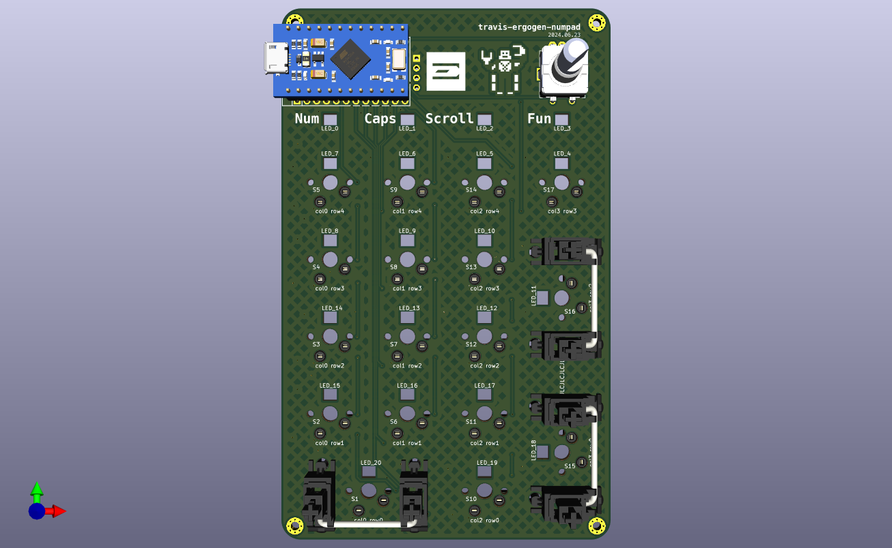

# travis-ergogen-numpad
A numpad made with Ergogen v4 and SMD components. *Alpha* quality!

## Parts ##

JLCPCB PCBA:
* 17 @ C5184526 Kailh CPG151101S11-1 Mechanical Keyboard Shaft ROHS https://jlcpcb.com/partdetail/Kailh-CPG151101S111/C5184526
* 18 @ C7420318 hongjiacheng 1N4148W SOD-123 Switching Diode ROHS https://jlcpcb.com/partdetail/hongjiacheng-1N4148W/C7420318
* 21 @ C5149201 OPSCO Optoelectronics SK6812MINI-E SMD RGB LEDs(Built-in IC) ROHS https://jlcpcb.com/partdetail/OPSCOOptoelectronics-SK6812MINIE/C5149201
* 21 @ C710467 HUI JU NM1206B104K251CEGN 100nF X7R ±10% 1206 Multilayer Ceramic Capacitors MLCC - SMD/SMT ROHS https://jlcpcb.com/partdetail/HUIJU-NM1206B104K251CEGN/C710467
* C4747954 KNSCHA RST470UF10V029 470uF 10V 260mA@120Hz ±20% SMD,D6.3xL7.7mm Aluminum Electrolytic Capacitors - SMD ROHS https://jlcpcb.com/partdetail/KNSCHA-RST470UF10V029/C4747954

Aliexpress:
* Rotary encoder: EC11 12.5mm 5pcs https://www.aliexpress.us/item/2251832789732148.html
* RP2040 Pro Micro 16M https://www.aliexpress.us/item/3256805943704472.html
* 0.91 Inch OLED Module 0.91" White Blue 128X32 https://www.aliexpress.us/item/3256805787666312.html

Adafruit:
* 2 @ Kailh Mechanical Key Switches - Tactile Brown - 10 pack - Cherry MX Brown Compatible https://www.adafruit.com/product/4954
* Woven USB Cable with USB A to Right Angle USB C https://www.adafruit.com/product/5031

## References ##

* [sadekbaroudi's QMK RGB Matrix configuration](https://github.com/sadekbaroudi/keyboard-guides/blob/master/firmware/qmk/RGB_MATRIX/RGB_MATRIX.md)
* [my first KB](https://github.com/dieseltravis/travis-ergogen-2024/)