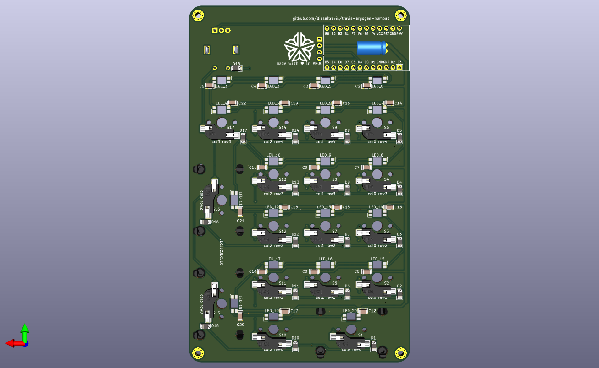

# travis-ergogen-numpad
A numpad made with Ergogen v4 and SMD components. *Alpha* quality!

## Parts ##

TODO: list SMD diodes & caps

Aliexpress:
* Rotary encoder: EC11 12.5mm 5pcs https://www.aliexpress.us/item/2251832789732148.html
* RGB LEDs: SK6812 MINI-E 100pcs https://www.aliexpress.us/item/3256802596102446.html
* RP2040 Pro Micro 16M https://www.aliexpress.us/item/3256805943704472.html
* 0.91 Inch OLED Module 0.91" White Blue 128X32 https://www.aliexpress.us/item/3256805787666312.html

Adafruit:
* 2 @ Kailh Switch Sockets for MX-compatible Mechanical Keys - 20 Pack https://www.adafruit.com/product/4958
* 2 @ Kailh Mechanical Key Switches - Tactile Brown - 10 pack - Cherry MX Brown Compatible https://www.adafruit.com/product/4954
* Woven USB Cable with USB A to Right Angle USB C https://www.adafruit.com/product/5031
